# corral — benchmark: TypeScript vs Go vs Rust

Same machine (Apple Silicon arm64, macOS, 16 GB RAM), **same HTTP routes**, **same
client**, **same machine**. Charts use the real measured values on their axes;
tables under each chart give the exact numbers.

> Prefer an interactive version? Open `benchmark.html` in a browser.

## Scorecard (0–100, higher is better)

| Dimension | TypeScript / Bun | Go | Rust |
| --------- | :--------------: | :-: | :--: |
| Deploy size | 0 | 46 | **100** |
| Idle memory | 0 | 47 | **100** |
| Load memory | 0 | 58 | **100** |
| Startup | 0 | 70 | **100** |
| JSON throughput | 40 | 49 | **100** |
| Source size | 0 | **100** | 77 |
| Ecosystem / iteration | **100** | 75 | 50 |

## Deploy footprint (MiB — lower is better)

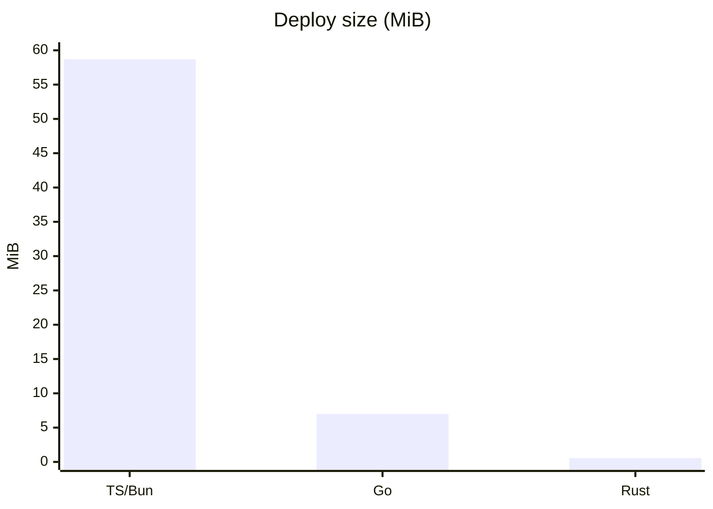

| Runtime | End-to-end | App/binary only | Runtime needed |
| ------- | :--------: | :-------------: | :------------- |
| TypeScript / Bun | 58.7 MiB | 72 KB | Bun (~59 MB) |
| Go | 6.98 MiB | 10.26 MiB raw | none (static) |
| Rust | **0.56 MiB** | 575 KB | **none** |

## Memory (MB — lower is better)

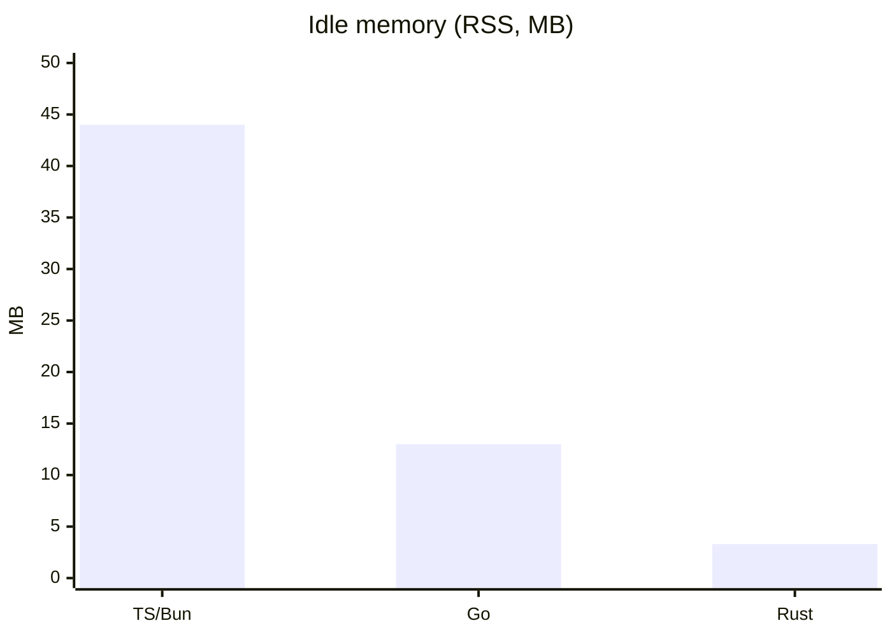

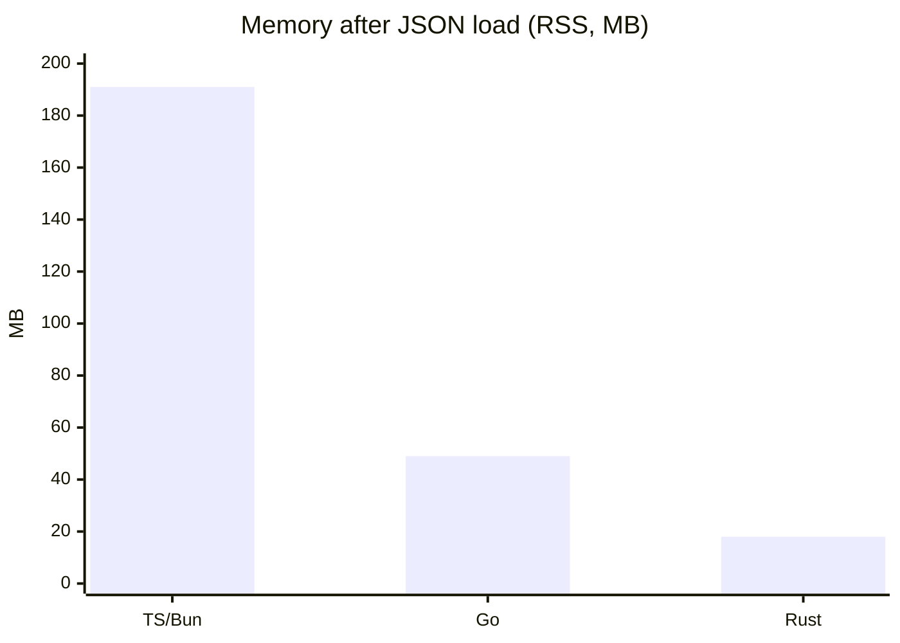

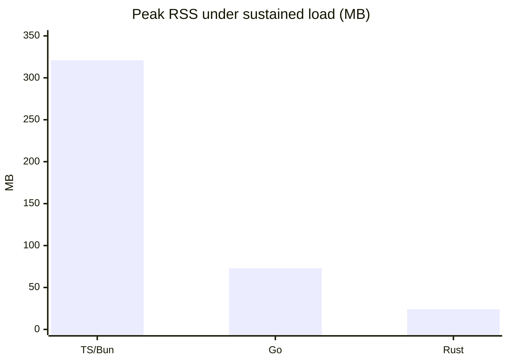

| Memory state | TypeScript / Bun | Go | Rust |
| ------------ | :--------------: | :-: | :--: |
| Idle (RSS) | 44 MB | 13 MB | **3.3 MB** |
| After one JSON load | 191 MB | 49 MB | **18 MB** |
| Peak under sustained load | 321 MB | 73 MB | **24 MB** |
| Memory over time | keeps climbing | grows then flat | **flat** |

## Cold start to healthy (ms — lower is better)

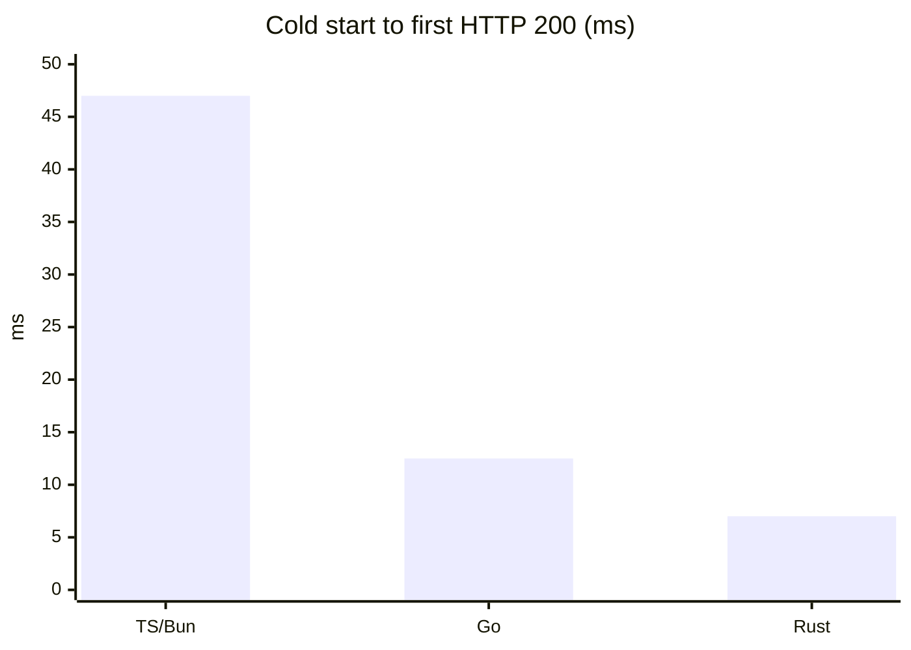

| Runtime | Startup |
| ------- | :-----: |
| TypeScript / Bun | 47 ms |
| Go | 12.5 ms |
| Rust | **7 ms** |

## Throughput (req/s — higher is better)

`GET /health` is trivial (route match + an 11-byte literal), so it is bound by
the loopback client and all three tie. `GET /api/events?limit=200` is the real
work (tail read + parse + validate + redact + re-serialize 200 records) — that
is where the languages separate.

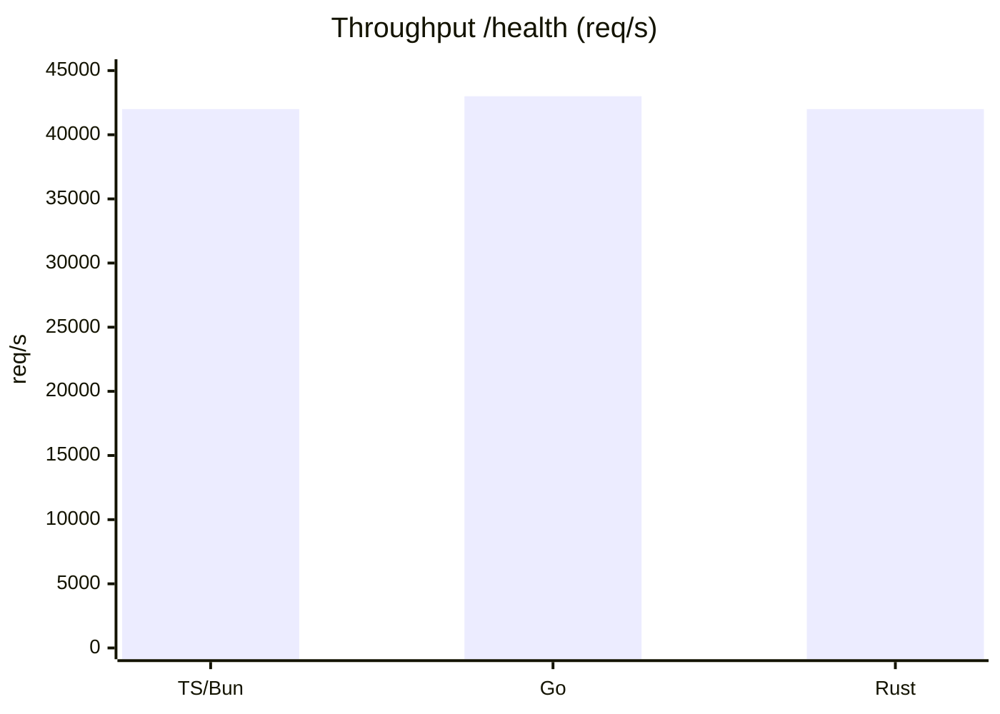

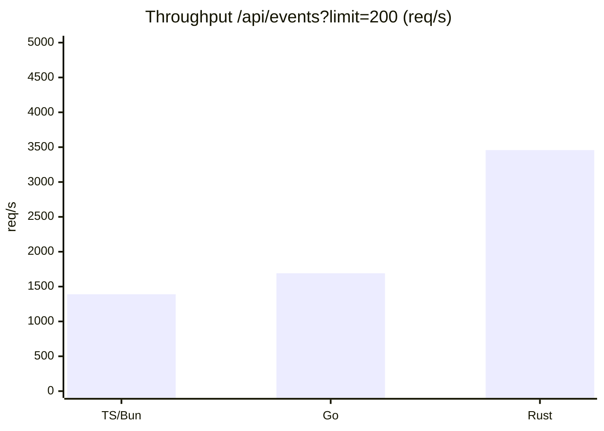

| Route | TypeScript / Bun | Go | Rust |
| ----- | :--------------: | :-: | :--: |
| `GET /health` | ~42,000 | ~43,000 | ~42,000 |
| `GET /api/events?limit=200` | 1,390 | 1,691 | **3,458** |
| Peak `/api/events` | 1,553 | 2,301 | **4,428** |

### Throughput vs concurrency

Series order in each chart: **TypeScript / Bun → Go → Rust**.

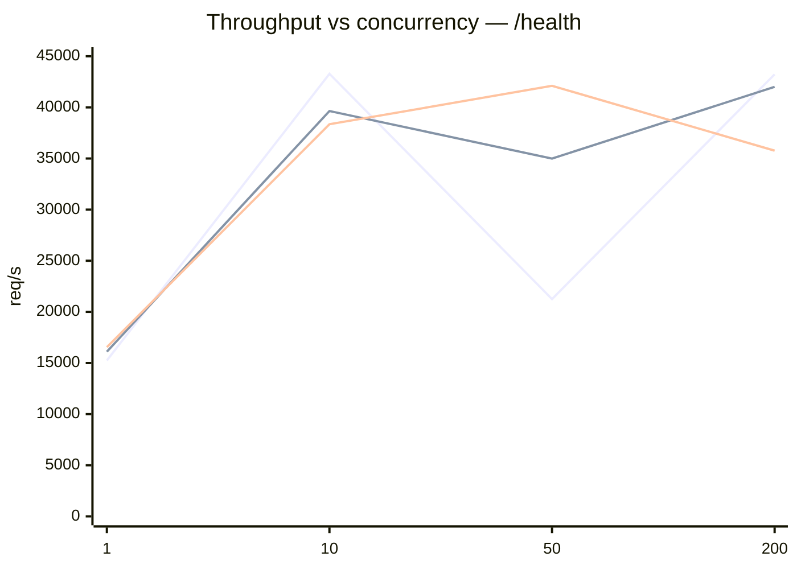

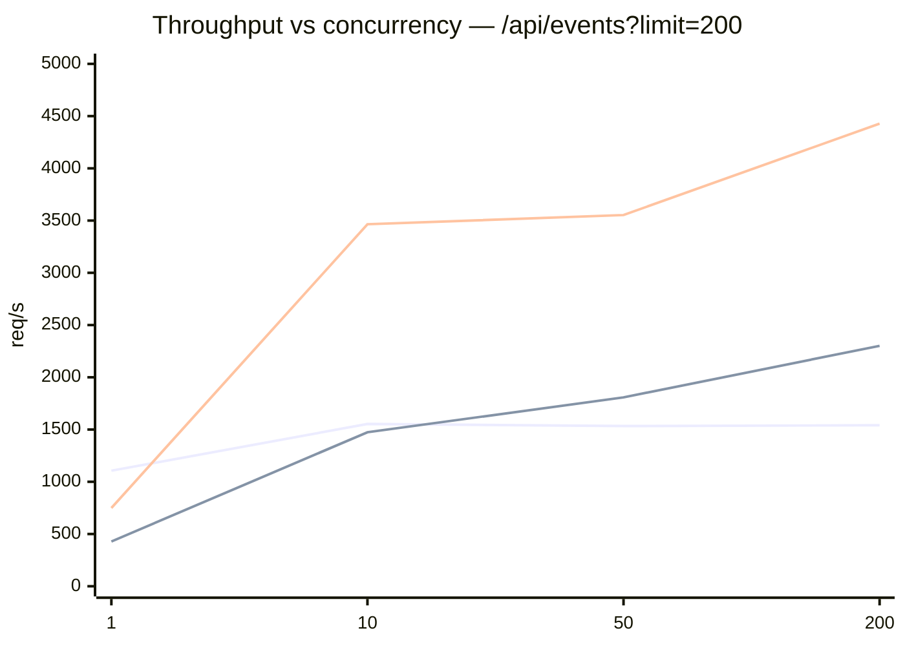

| Concurrency | TS `/health` | Go `/health` | Rust `/health` | TS `events` | Go `events` | Rust `events` |
| :---------: | :----------: | :----------: | :------------: | :---------: | :---------: | :-----------: |
| 1 | 15,247 | 16,102 | 16,544 | 1,106 | 428 | 749 |
| 10 | 43,282 | 39,643 | 38,347 | 1,553 | 1,474 | 3,465 |
| 50 | 21,251 | 34,992 | 42,109 | 1,533 | 1,808 | 3,553 |
| 200 | 43,230 | 42,013 | 35,767 | 1,541 | 2,301 | **4,428** |

## Latency — `/api/events?limit=200` @ concurrency 50 (ms — lower is better)

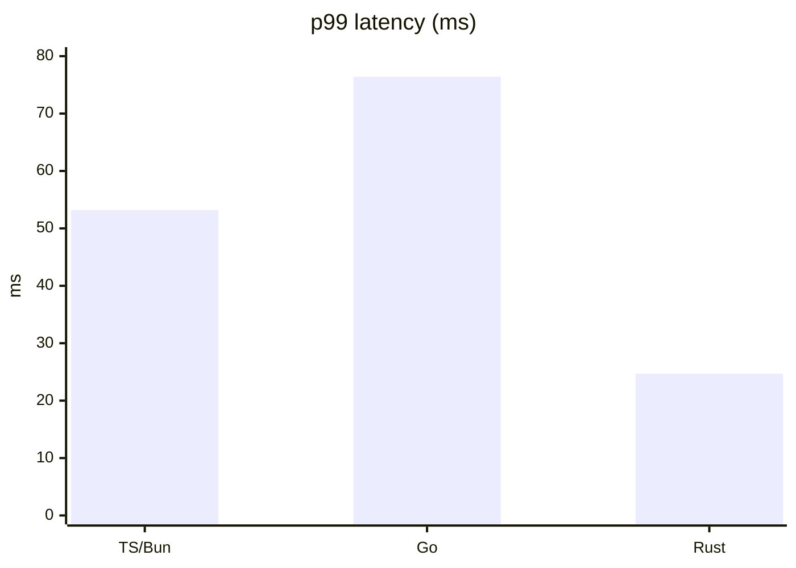

| Percentile | TypeScript / Bun | Go | Rust |
| ---------- | :--------------: | :-: | :--: |
| p50 | 32.2 ms | 23.0 ms | **13.6 ms** |
| p90 | 43.1 ms | 48.2 ms | **19.0 ms** |
| p99 | 53.2 ms | 76.4 ms | **24.7 ms** |

## Memory over time under sustained load (RSS, MB)

Sampled every 100 ms during the `/api/events?limit=200` @ concurrency-50 run.
Series order: **TypeScript / Bun → Go → Rust**.

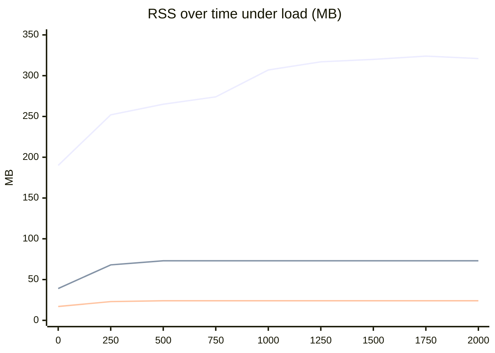

| Time (ms) | TypeScript / Bun | Go | Rust |
| :-------: | :--------------: | :-: | :--: |
| 0 | 190 | 39 | 17 |
| 500 | 265 | 73 | 24 |
| 1000 | 307 | 73 | 24 |
| 1500 | 320 | 73 | 24 |
| 2000 | 321 | 73 | 24 |

## Source size & dependencies (lower is better)

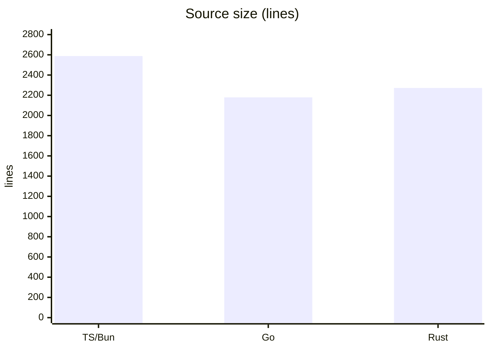

| Runtime | Lines | Third-party deps |
| ------- | :---: | :--------------- |
| TypeScript / Bun | 2,588 | 0 (+ Bun) |
| Go | **2,179** | 0 (stdlib) |
| Rust | 2,272 | serde, serde_json, libc |

## Takeaway

- **Rust** — smallest deploy (0.56 MiB), lowest and flattest memory (3.3 MB idle →
  24 MB peak), fastest start (7 ms), fastest JSON/tail path (3,458 req/s, ~2.5×
  TS), and the lowest tail latency.
- **Go** — one static binary, no runtime, stdlib only; a solid middle ground.
- **TypeScript / Bun** — quickest to iterate on, but heaviest runtime footprint
  and memory that keeps growing under load.
